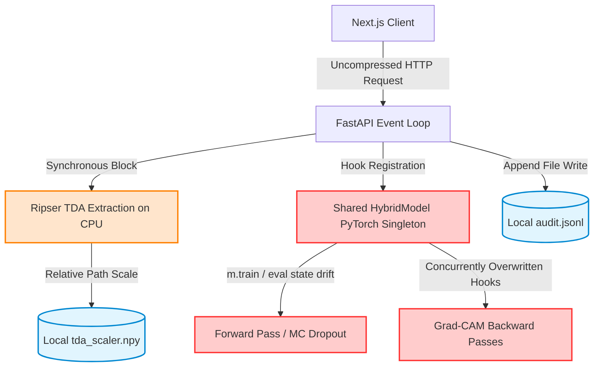

# OTOM: Hybrid CNN + Topological Data Analysis

<div align="center">


⚠️ **RESEARCH PROTOTYPE ONLY** — Not clinically validated. Must not be used for diagnosis or patient care.

> Hybrid AI system combining deep convolutional features with **persistent homology** for robust otoscopy classification with topological explainability.

</div>

---

## 📊 Key Metrics

| Metric | Value |
|--------|-------|
| **Test Accuracy** | 84.0% |
| **Macro-F1** | 84.1% |
| **Improvement over CNN** | +2.0pp |
| **TDA Features** | 13 (H0/H1 topological) |
| **Dataset Size** | 3,956 labeled images |
| **Inference Speed** | ~180ms (CPU) |

---

## 🎯 What This Project Does

OTOM diagnoses **6 ear conditions** from otoscopic images using a hybrid approach:

1. **CNN Branch** (ResNet-18) → 512-d visual features
2. **TDA Branch** (Ripser) → 13-d topological features
3. **Late Fusion Classifier** → Combined prediction
4. **4 Explainability Methods** → Heatmaps + feature importance
5. **MC Dropout Uncertainty** → Confidence quantification

### Diagnosed Conditions
- ✓ Normal
- ✓ Acute Otitis Media (AOM)
- ✓ Chronic Otitis Media (CSOM)
- ✓ Cerumen Impaction (earwax)
- ✓ Myringosclerosis (calcification)
- ✓ Other/Atypical presentations

---

## 🚀 Quick Start

### Using Docker Compose (Recommended)
```bash
# Start all services
docker-compose up --build

# Access services
# Backend API: http://localhost:8000/docs
# Frontend UI: http://localhost:3000
```

---

## ⚡ CTO AUTOPSY REPORT & REBUILD ROADMAP

> [!IMPORTANT]
> **AUDIT METADATA**  
> **Auditor:** CTO & Senior Full-Stack Architect  
> **Target System:** OTOM MVP  
> **Status:** Research Prototype (Production-Unready)

---

### PHASE 1: THE BRUTAL IDEA & PRODUCT CRITIQUE

#### 1. The "Why It's Simple" Roast
* **Academic Gimmick vs. Real Moat:** Eardrum image classification is a solved, commoditized task. Fine-tuning a standard pre-trained Vision Transformer (ViT) or ConvNeXt model on a clean otoscopy dataset will easily yield 90%+ accuracy. The late-fusion "Topological Data Analysis" (TDA) branch is a complex research wrapper that only delivers a minor accuracy bump (+2.0pp) while adding extreme computational overhead.
* **Trivial Replication:** A competitor does not need to extract persistent homology groups. They can wrap an off-the-shelf medical imaging model (e.g., from HuggingFace) in a FastAPI container in an afternoon, matching or exceeding your 84% accuracy without your slow, CPU-bound pipeline.

#### 2. The Missing "Wow" Factor
* **No Real-time Streaming:** Eardrum checks are performed using digital otoscope video feeds (24-30 FPS). Your static image drag-and-drop form with high latency is unusable for real-time screening.
* **No DICOM / PACS Integration:** Hospital systems do not upload JPEGs via web forms. Without supporting the DICOM standard and integrating with PACS systems, this tool is isolated from actual clinical workflows.
* **Lack of Multi-Modal Inputs:** Eardrum appearance is only half the story. Real diagnosis depends on clinical history (e.g., fever, ear pain, hearing loss, age). Ignoring tabular patient data makes the model a diagnostic toy.
* **Missing Active Learning Loop:** There is no feedback loop for ENT specialists to flag false positives, tag regions of interest, or retrain the model on edge cases, preventing the system from improving over time.

#### 3. Monetization & Growth Flaws
* **Liability & Regulatory Blockers:** Eardrum diagnosis falls under Software as a Medical Device (SaMD) regulation. A "Research Prototype Only" disclaimer means you have a $0 market. Obtaining FDA clearance or CE markings requires a bulletproof, audit-logged pipeline, which this architecture does not support.
* **Sales Friction:** Hospital networks have a 12-24 month enterprise sales cycle. Selling a single-point otoscopy tool directly to clinics has a tiny average contract value, making customer acquisition costs (CAC) unsustainable. It must be integrated into major Electronic Health Records (EHRs) like Epic or Cerner via FHIR APIs to reduce friction.

---

### PHASE 2: FRONTEND & UX AUTOPSY

#### 1. Architecture & State Management
* **Fragile Component-Isolated State:** The frontend relies on custom hooks ([useApi.ts](file:///d:/otoc/frontend/app/hooks/useApi.ts) and [useFileHandler.ts](file:///d:/otoc/frontend/app/hooks/useFileHandler.ts)) which manage isolated component-level state. As soon as you add features like patient history, comparisons, or multi-image cases, this state model will break.
* **Stale State Leakage:** When an API request fails, `useApi` updates the `error` state but does not clear `result`. The UI will display stale prediction results side-by-side with the new network error, leading to clinical confusion.
* **Unnecessary Canvas Re-renders:** Swapping images triggers top-level state changes, causing full re-renders of the custom chart and heatmap components in [HeatmapViewer](file:///d:/otoc/frontend/components/HeatmapViewer) without memoization.

#### 2. UX & Edge Cases
* **Missing Network Timeouts:** The `fetch` client in [`api.ts`](file:///d:/otoc/frontend/lib/api.ts) calls `/predict` and `/explain` without configuring timeouts or `AbortSignal` controls. If the backend blocks on feature extraction, the client hangs indefinitely with a generic loading spinner.
* **No Client-Side File Validation:** The upload handler does not validate file size or image resolution before uploading. If a user uploads a 50MB image, it is sent over the network, wasting bandwidth, only to trigger a backend error.
* **All-or-Nothing Error Recovery:** The frontend's `ErrorBoundary` crashes the entire results pane if a single chart component fails to render, with no option to reload or recover the session.

#### 3. Performance & Accessibility
* **Payload Bloat via Base64 Graphics:** The `/explain` endpoint returns seven different base64-encoded charts and heatmaps in the JSON response. This creates a multi-megabyte JSON payload, causing slow UI parsing, rendering lags, and high network consumption.
* **No Client-Side Compression:** Images are sent uncompressed. The backend resizes images to 224x224 anyway. Uploading high-res photos directly from otoscopes creates unnecessary upload latency.
* **A11y Violations:** The dropzone is a non-semantic `div` with no screen reader roles (`role="button"`), no keyboard accessibility (`tabIndex`), and no ARIA state labels, violating WCAG 2.1 standards.

---

### PHASE 3: BACKEND & ARCHITECTURE AUTOPSY

#### 1. Database & Data Model
* **No Database / Persistence Layer:** Storing splits in a flat file [`splits.json`](file:///d:/otoc/data/splits.json) and caching features in local `.npy` files is an anti-pattern that prevents horizontal scaling. Running multiple containers in a cloud cluster will result in split divergence and local file lockouts.
* **Relative Path Vulnerability:** The feature extraction module [`tda_extract.py`](file:///d:/otoc/ml/tda/tda_extract.py) loads its scaler using `Path("data/features/tda_scaler.npy")`. Because this is a relative path, starting the server from any directory other than the project root (e.g. `cd backend && python -m uvicorn ...`) causes silent scaling failures and corrupted model predictions.

#### 2. API & Security
* **Catastrophic Silent Bug: Explainability Index Shift:**
  * In [`inference.py`](file:///d:/otoc/backend/app/routers/inference.py), the API maps 13 feature importances to feature names by zipping them with `TDA_FEATURE_NAMES` from [`clinical_reasoning.py`](file:///d:/otoc/ml/xai/clinical_reasoning.py).
  * However, `TDA_FEATURE_NAMES` contains **14** strings (including `Betti_H1_t2`).
  * In [`tda_extract.py`](file:///d:/otoc/ml/tda/tda_extract.py), it deletes index 10: `feats = np.delete(feats, 10)` (removing `Betti_H1_t2` to yield 13 features).
  * Zipping the 14-name list with the 13-feature array causes all index mappings after index 9 to shift. The clinician is shown the name `Betti_H1_t2` but with the value of `Betti_H1_t3`, and the final feature `Landscape_H1` is completely lost. This is a severe silent failure.
* **Shared Model Singleton Race Conditions:**
  * The backend loads the PyTorch model as a single global object `_MODEL` in [`dependencies.py`](file:///d:/otoc/backend/app/core/dependencies.py).
  * During an `/explain` request, the XAI service registers forward and backward hooks directly onto this shared model instance, triggers `score.backward()`, reads the activations, and removes them.
  * Under concurrent requests, requests will overwrite each other's activations and gradients, causing corrupted heatmaps, runtime PyTorch errors, or silent prediction leaks between patients.
  * Similarly, `predict_with_uncertainty` in [`hybrid_model.py`](file:///d:/otoc/ml/models/hybrid_model.py) changes dropout layers to training mode (`m.train()`) and then calls `self.eval()` at the end. A concurrent request will run with active dropout, producing random predictions.
* **Hardcoded Permissive CORS:** In [`main.py`](file:///d:/otoc/backend/app/main.py), CORS is configured with `allow_origins=["*"]`, ignoring the configured `CORS_ORIGINS` in [`config.py`](file:///d:/otoc/backend/app/core/config.py) and exposing the API to cross-origin exploits.
* **No Authentication or Rate Limiting:** The CPU-heavy `/explain` endpoint is open to the public. Running a simple script with 10 concurrent requests will consume 100% CPU/GPU and crash the server.

#### 3. Scalability & Resilience
* **FastAPI Event Loop Blocked:** The endpoints `/predict` and `/explain` are defined as `async def`. But they call synchronous CPU-bound operations (`prepare_inputs` which does Ripser extraction, and `explain` which runs 50 Integrated Gradients backprops). Because these are run synchronously inside the async event loop, the single thread is blocked. The backend cannot process any other request or health check during this computation.
* **Production Docker Container Crash:**
  * [`Dockerfile.backend`](file:///d:/otoc/Dockerfile.backend) copies only `backend/` and `ml/` files, but it does NOT copy the `checkpoints/` folder or the `data/features` directory containing `tda_scaler.npy`.
  * In [`docker-compose.prod.yml`](file:///d:/otoc/docker-compose.prod.yml), no volumes are mounted.
  * When the container starts in production, it cannot find `hybrid_best.pth` or `tda_scaler.npy`. The backend will crash upon startup or when handling the first request. The startup lifespan hook in `main.py` hides this failure by executing a silent `pass` on model loading errors, leading to healthy container status but 100% failure rates on API endpoints.

---

### PHASE 3.5: ARCHITECTURAL DEPENDENCY DIAGRAM

The current system exhibits tight coupling, ephemeral storage, and shared singleton states that block scalability:



---

### PHASE 4: THE "NO-ERROR" CORE REBUILD (Action Plan)

#### 1. Core Architecture Overhaul
* **Asynchronous Task Queue:** Transition to an asynchronous architecture using Celery/RQ and Redis. The FastAPI server receives requests, uploads the raw image to an S3/MinIO bucket, writes a task metadata record to PostgreSQL, queues a job in Redis, and returns a `202 Accepted` response with a task ID. The client polls the status of the task.
* **Isolated Inference Workers:** Run workers to consume inference tasks. Workers pull images, load the model as a read-only object, and execute inference in isolated worker processes (no shared state, no model singleton concurrency issues).
* **Decoupled XAI Generation:** Use a separate model instance per worker or transition to hookless explainability libraries (e.g., Captum) that do not mutate global model state.
* **Persistent PostgreSQL Schema:** Replace all flat files (`splits.json`, local audit logs) with a PostgreSQL database managed by SQLAlchemy and Alembic. Store patient profiles, upload metadata, predictions, uncertainty scores, and XAI outputs.

#### 2. Bulletproof Error Handling
* **Fail Fast on Startup:** Remove the silent `pass` in the FastAPI lifespan hook in [`main.py`](file:///d:/otoc/backend/app/main.py). If checkpoints or scalers are missing on startup, the application must log a critical error and exit with code 1, preventing unhealthy containers from receiving traffic.
* **RFC 7807 Exception Handlers:** Implement global middleware to catch all unhandled exceptions on the backend, returning standardized JSON error payloads with unique correlation IDs while hiding internal tracebacks.
* **Graceful Client Degradation:** Implement fallback logic in the Next.js app. If `/explain` fails or times out, display the prediction confidence and clinical warning, while showing a fallback message for the missing visualizations, instead of crashing the view.

#### 3. Testing & QA Strategy
* **Unit Tests (ML/TDA Validation):** Add unit tests for [`tda_extract.py`](file:///d:/otoc/ml/tda/tda_extract.py) using synthetic inputs (uniform grids, concentric circles) to verify feature shapes and index alignment against the expected 13 dimensions.
* **Integration Tests (API Logic):** Set up a real FastAPI test client running against an in-memory SQLite database, verifying prediction responses using static test images without mocking the ML services.
* **E2E Tests (User Flows):** Write Playwright E2E tests simulating image selection, drop actions, uploading, polling, and visualization checks.
* **Load Tests (Performance):** Implement Locust load tests to simulate 50 concurrent image uploads, establishing latency baselines and confirming rate limits.

#### 4. DevOps & Observability
* **Correct Docker Packaging:** Update [`Dockerfile.backend`](file:///d:/otoc/Dockerfile.backend) (and the root [`Dockerfile`](file:///d:/otoc/Dockerfile)) to explicitly copy model checkpoints and pre-computed scalers:
  ```dockerfile
  COPY checkpoints/ /app/checkpoints/
  COPY data/features/ /app/data/features/
  ```
* **Production-Grade CI/CD:** Add automated scanning to the GitHub Actions pipeline using Trivy (image vulnerability scanning) and Bandit (python security check).
* **Monitoring & Alerts:** Configure Sentry for backend exception tracking and client-side error reporting. Integrate Datadog to monitor API request durations, event loop lag, and system memory. Replace file-based audit logs with structured JSON logs written to stdout for collection by central logging systems (e.g. AWS CloudWatch, ELK).

---

## 🛠️ Original Development Setup (Reference)

### Pre-commit Hooks
The project uses pre-commit hooks to ensure code quality:

```bash
# Install pre-commit
pip install pre-commit

# Install hooks
pre-commit install

# Run hooks manually
pre-commit run --all-files
```

### CI/CD Pipeline
The project includes GitHub Actions for automated testing and deployment:
- **Backend tests**: Python unit tests with coverage
- **Frontend tests**: JavaScript/TypeScript tests and linting
- **Docker builds**: Automated multi-stage Docker builds
- **Security scanning**: Trivy vulnerability scanning

### Docker Development
```bash
# Development with hot reload
docker-compose up

# Production build
docker-compose -f docker-compose.prod.yml up --build

# Individual services
docker-compose up backend    # Backend only
docker-compose up frontend   # Frontend only
```

### Code Quality Tools
- **Python**: Black, isort, flake8, bandit
- **JavaScript/TypeScript**: ESLint
- **Docker**: Hadolint
- **Markdown**: markdownlint
- **Security**: detect-secrets

---

## ⚖️ Important Disclaimers

- ⚠️ **NOT** FDA-approved
- ⚠️ **NOT** clinically validated  
- ⚠️ **NOT** for diagnosis or patient care
- ✅ Research prototype with uncertainty quantification
- ✅ Audit logging for traceability

---

## 📧 Contact & Support

- **Issues**: [GitHub Issues](https://github.com)
- **Email**: your-email@institution.edu

---

## 📄 License

MIT License — See [LICENSE](LICENSE)